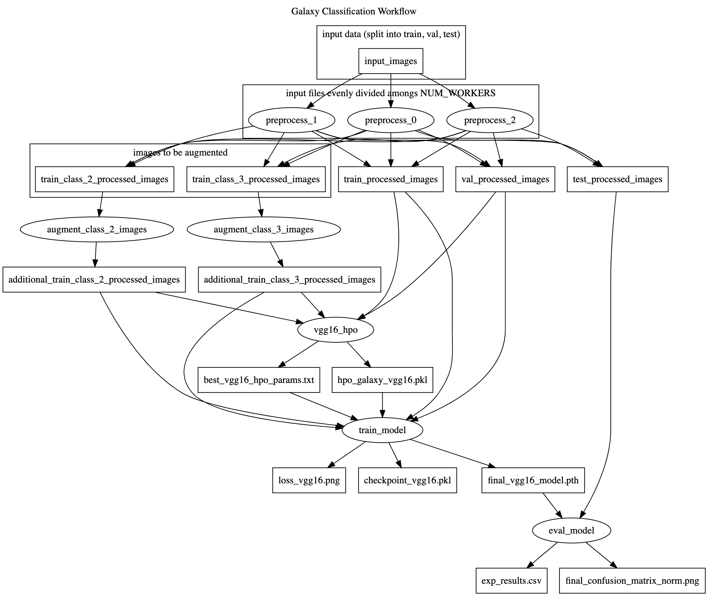

# Galaxy Classification Workflow




```python
python3 run_workflow.py --data_path galaxy_data/
```

## Test Dataset is provided


```
usage: run_workflow.py [-h] [--batch_size BATCH_SIZE] [--seed SEED] [--data_path DATA_PATH] [--epochs EPOCHS]
                       [--trials TRIALS] [--num_workers NUM_WORKERS] [--num_class_2 NUM_CLASS_2]
                       [--num_class_3 NUM_CLASS_3] [--maxwalltime MAXWALLTIME]

Galaxy Classification

optional arguments:
  -h, --help            show this help message and exit
  --batch_size BATCH_SIZE
                        batch size for training
  --seed SEED           select seed number for reproducibility
  --data_path DATA_PATH
                        path to dataset
  --epochs EPOCHS       number of training epochs
  --trials TRIALS       number of trials
  --num_workers NUM_WORKERS
                        number of workers
  --num_class_2 NUM_CLASS_2
                        number of augmented class 2 files
  --num_class_3 NUM_CLASS_3
                        number of augmented class 3 files
  --maxwalltime MAXWALLTIME
                        maxwalltime
```


## Steps of the Workflow


### Data Aqusition

Download the dataset: galaxy-zoo-the-galaxy-challenge.zip
Unzip it. 
(https://www.kaggle.com/c/galaxy-zoo-the-galaxy-challenge)

### Create "Clean" Dataset

inputs: 

galaxy-zoo-the-galaxy-challenge/images_training_rev1/ (FOLDER WITH IMAGES)
galaxy-zoo-the-galaxy-challenge/training_solutions_rev1.csv (CSV with meta data about galaxies)


```python
python create_dataset.py --output_dir full_galaxy_dataset
```

outputs:

| Class    | Number  |         Names of Files            |
|----------|:-------:|----------------------------------:|
| class 0  | 8436    | class_0_0.jpg to class_0_8435.jpg |
| class 1  | 8069    | class_1_0.jpg to class_1_8068.jpg |
| class 2  |  579    | class_2_0.jpg to class_2_578.jpg  |
| class 3  | 3903    | class_3_0.jpg to class_3_3902.jpg |
| class 4  | 7806    | class_4_0.jpg to class_4_7805.jpg |


final outputs:

| Class    |  Train |  Val   | Test   |
|----------|:------:|:------:|:------:|
| class 0  |  6733  |  858   |  845   |
| class 1  |  6449  |  817   |  803   |
| class 2  |   464  |   62   |   53   |
| class 3  |  3141  |  364   |  398   |
| class 4  |  6247  |  778   |  781   |
| TOTAL    | 23034  | 2879   | 2880   |


### Preprocess: Resize all the images (N parallel jobs)
Takes in all the files and then resize them. 

```python
python preprocess_resize.py
```
Rename files. (Needed for Pegasus)


### Preprocess: Data Augmentation

Takes in all images of a given class e.g. train_class_3_*  
```python
python augment_data.py --num 15 --class_str class_3
```
Outputs:
train_class_3_4000.jpg, ... train_class_3_4014.jpg
(15 new instances of class 3)


### HPO

```python
python vgg16_hpo.py --epochs 8 --trials 2
```
Outputs:

hpo_galaxy_vgg16.pkl (Checkpoint we can restart from)

best_vgg16_hpo_params.txt

early_stopping_vgg16_model_trial0.pth
early_stopping_vgg16_model_trial1.pth


### Train Model

```python
python train_model.py --epochs 10
```
Outputs:
checkpoint_vgg16.pth
final_vgg16_model.pth
loss_vgg16.png


### Evaluation

```python
python eval_model.py 
```
Outputs:
final_confusion_matrix_norm.png
exp_results.csv


### Pegasus Workflow

